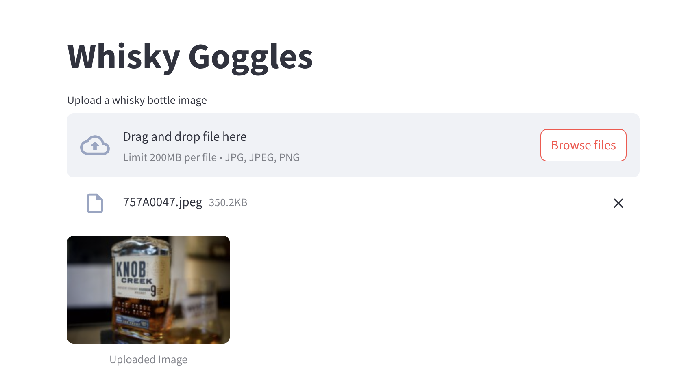
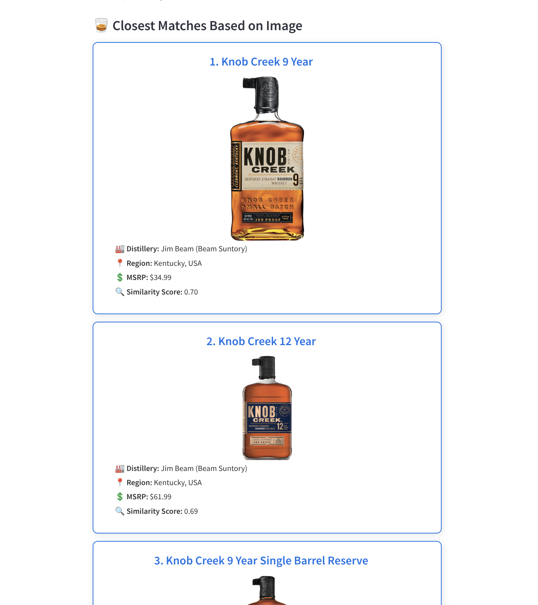

# Whisky Finder via Image

## Overview

The **Whisky Finder via Image** is a Streamlit-based application that uses AI to recommend similar whiskies based on an uploaded image of a whisky bottle.

### Features:
- 🖼️ **Upload a bottle image** and receive a detailed description of the whisky profile.
- 🥃 **Find similar whiskies** based on the image description.
- 📊 **AI-powered whisky profile summarization** for easy comparison.

## Installation

To run the Whisky Finder via Image, follow these steps:

1. **Clone the repository**  
   Clone the repository to your local machine.

   ```bash
   git clone https://github.com/Isaacgv/ai-image.git
   ```

2. **Install dependencies**  
   Navigate to the project directory and install the required packages using `pip`.

   ```bash
   cd whisky-finder-via-image
   pip install -r requirements.txt
   ```

3. **Set up your environment**  
   Create a `.env` file and add your OpenAI API key:

   ```plaintext
   OPENAI_API_KEY=your_openai_api_key
   ```

4. **Run the app**  
   Launch the application using Streamlit.

   ```bash
   streamlit run app.py
   ```

   The app should now be available in your browser at `http://localhost:8501`.

## How It Works

### Example Workflow:
1. **Upload Image:**  
   Upload an image of a whisky bottle.

   

2. **Similarity Search:**  
   The whisky profile is compared with other whiskies in the database to find the closest matches.

3. **Recommendation Display:**  
   The app displays the top N recommended whiskies with relevant details.

   

## Video Demo
   [Watch the video demo on YouTube](https://www.youtube.com/watch?v=rhJJGcgkI5M)
   
---

Enjoy discovering new whiskies and enhancing your collection with **Whisky Goggles** — your AI-powered whisky finder! 🥃
